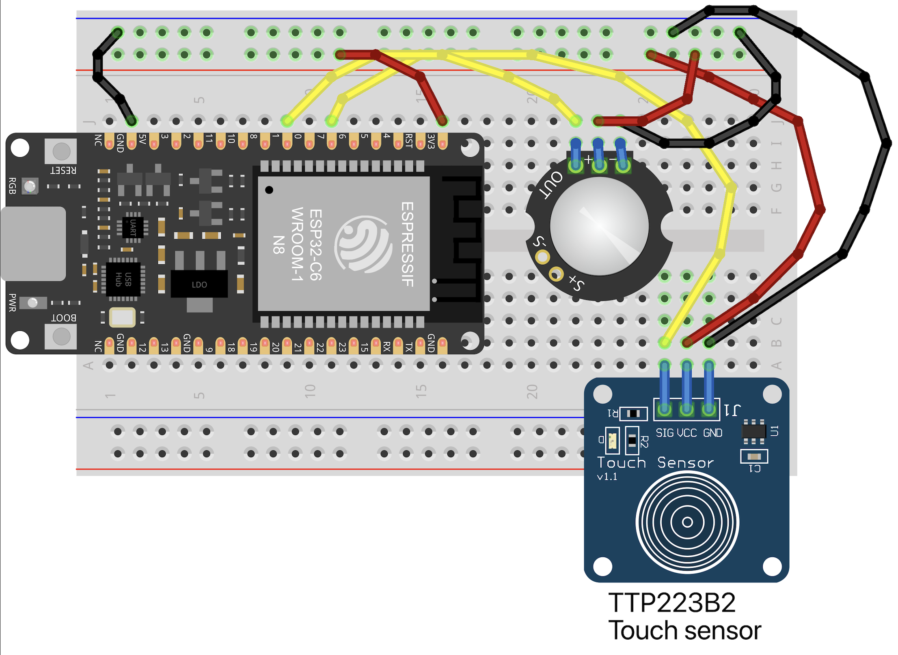
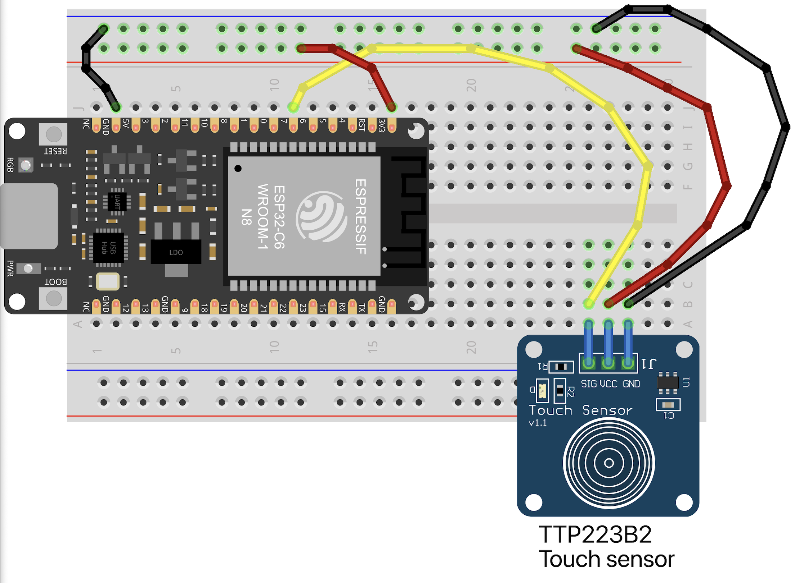
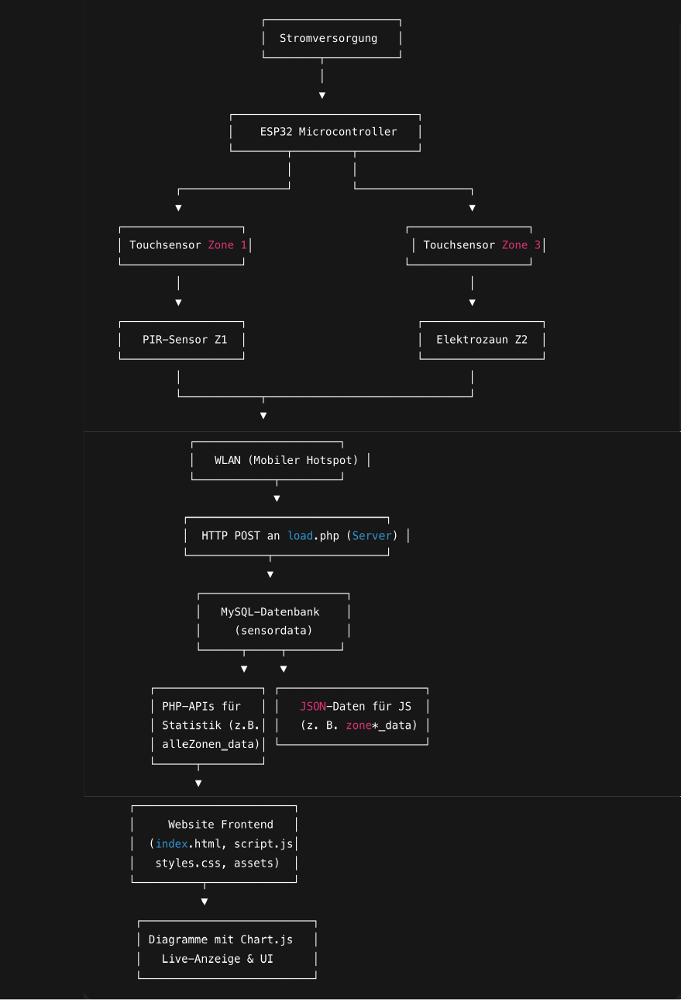

[](titelfoto.png)


# 🐌 SchnäggWägg – Ein smarter Schneckenzaun mit Sensorik und Datenvisualisierung

**SchnäggWägg** ist ein interaktives Sensorsystem zur Beobachtung und Analyse von Nacktschnecken in einem Hochbeet. Das Projekt entstand im Rahmen des Moduls **Interaktive Medien IV** an der Fachhochschule Graubünden.

Der Zaun besteht aus drei Zonen, die jeweils mit unterschiedlichen Sensoren ausgestattet sind. 

[](zonen.png)


Zone 1:  Touch- und PIR-Sensor
Zone 2:  Webseiten- und Microcontroller-unabhängige Zone mit zertifiziertem Schnecken-Elektoschock
Zone 3:  Touchsensor
Mit der ersten Zone wird gemessen, wie viele Schnecken das Beet zu durchqueren versuchen. Mit der dritten Zone wird kontrolliert, wie viele Schnecken es bis zur obersten Zone schaffen und somit nicht vom Elektrozaun abgeschreckt worden sind. Daraus lässt sich dann lesen, wie effektiv der leichte Stromimpuls in Zone 2 abschreckt. Die gesammelten Daten werden auf meiner Webseite grafisch dargestellt und bieten eine anschauliche Übersicht über das Verhalten der Tiere.

***zu meiner Webseite: mariareichmuth.ch/schnaeggwaegg***

---

## Projektidee

Ziel war es, ein smartes, datengestütztes System zu entwickeln, das hilft, Nacktschnecken **ohne Chemie oder Giftstoffe** aus Hochbeeten fernzuhalten. Der mehrzonige Aufbau ermöglicht es, das Verhalten der Schnecken detailliert zu beobachten und die Wirksamkeit des Elektrozauns in Zone 2 zu evaluieren.

Das Projekt kombiniert **physische Sensorik (Touch, PIR, Stromimpuls)** mit **Datenanalyse und Webvisualisierung** – und stellt so eine innovative Lösung für den biologischen Pflanzenschutz dar.

***zu meiner Videodokumentation: https://www.youtube.com/watch?v=AhdaGe-4r7M***

***zu meinem Screenflow: https://www.figma.com/design/ie0jRockpIH0OXrFspZTj8/IMIV-%E2%80%93-App-Konzeption-Maria-Reichmuth-mmp23cv---2025?node-id=1402-201&m=dev&t=LD4EWs5bGLMkbkQ5-1***
---

## Technische Umsetzung


### Hardware-Komponenten

- **2 × ESP32** – Mikrocontroller zur Steuerung der Sensorlogik und Datenübertragung via WLAN
- **2 × Touch- und 1 × PIR-Sensor** – In Zone 1 und Zone 3 zur Erkennung von Schneckenbewegungen  
- **Zone 2 (Elektrozaun)** – Gibt bei Berührung einen kurzen Impuls ab, der die Schnecken abschreckt, aber nicht tötet oder verletzt  
- **Stromversorgung** – Über Netzteil  
- **WLAN-Verbindung** – Mittels mobilem WLAN-Router mit Datenabo, damit die Microcontroller auch direkt auf dem Acker zuverlässig funken können
- **Verpackung** – wasserdichte Gartenbox

[](microcontroller.jpeg)

[](steckplan_1.png)

[](steckplan_2.png)

[](verpackung.png)
### Software-Komponenten

- **Arduino IDE** – Die ESP32-Mikrocontroller wurden mit der Arduino-Entwicklungsumgebung programmiert. Die Firmware erkennt Sensordaten, prüft Änderungen, synchronisiert die Uhrzeit über NTP und sendet JSON-Daten an den Server.

- **Verwendete Arduino-Bibliotheken:**
  - `WiFi.h` – Aufbau der WLAN-Verbindung
  - `HTTPClient.h` – Übertragung der JSON-Daten via HTTP-POST
  - `NTPClient.h` – Zeitsynchronisation mit einem Zeitserver (UTC)
  - `WiFiUdp.h` – Unterstützt den NTPClient für UDP-Kommunikation
  - `ArduinoJson.h` – Erzeugt JSON-Strings zur Datenübertragung
  - `Wire.h` – (bei Bedarf für I²C-Kommunikation, z. B. für Displays oder andere Sensoren)

- **ESP32-Firmware** – Enthält Logik zur:
  - Auswertung von Sensorzuständen (Touch & PIR)
  - Filterung wiederholter oder redundanter Ereignisse
  - Zeitbasierten Ereigniserkennung (z. B. wenn nur 1× pro Minute gesendet werden soll)
  - Senden der Daten an die zentrale PHP-API

- **PHP-APIs** – Empfangen die Daten vom ESP32, speichern sie in der MySQL-Datenbank und liefern strukturierte JSON-Antworten an die Website

- **MySQL-Datenbank** – Speichert jede relevante Bewegung mit Zeitstempel, Geräte-ID, Status und Sensortyp

- **Frontend (HTML, CSS, JavaScript)** – Die Website visualisiert alle Daten in Form von Diagrammen (Chart.js), berechnet Erfolgsquoten und erlaubt den Wechsel zwischen Tages- und Wochenansicht

---
[](komponentenplan.png)


## Aufbau der Website

Die Website bietet verschiedene Seiten und Funktionen zur **Live-Überwachung** und **statistischen Auswertung** der Sensordaten.

### Hauptfunktionen

- **Live-Anzeige** der letzten Aktivität in allen Zonen (ausser Zone 2, da dort keine Daten gemessen werden)
- **Erfolgsquote-Berechnung** aus Vergleich Zone 1 und Zone 3
- **Diagramme mit 7- oder 30-Tage-Ansicht**
- **Navigation zwischen allen Zonen**

Alle Daten werden per JavaScript (AJAX) von PHP-Endpunkten geladen und mit **Chart.js** dargestellt.

---

## Projektstruktur

```
/                       # Projektverzeichnis
├─ db_config.php        # Datenbank-Verbindungsdaten
├─ load.php             # API für eingehende ESP32-Daten
├─ daten_api.php        # Liefert Live-Daten (ID, Touch, PIR, Zeit, Gerät)
├─ zone*_data.php       # JSON-Endpunkte für Chart-Daten (letzte 30 Tage)
├─ alleZonen_data.php   # Berechnet Erfolg in Zone 2 und Summen
├─ index.html           # Hauptseite mit Intro, Live- & Statistik-Ansicht
├─ styles.css           # Design & responsive Layout
├─ script.js            # Interaktionslogik, AJAX-Aufrufe & Chart.js
└─ assets/

```

---

## Einrichtung und Verwendung

1. **Datenbank anlegen**  
   In deiner MySQL-Umgebung eine neue Datenbank und Tabelle `sensordata` mit folgenden Spalten erstellen:
   - `id` (INT, AUTO_INCREMENT)
   - `touch` (BOOLEAN oder TINYINT)
   - `pir` (BOOLEAN oder TINYINT)
   - `status` (optional)
   - `zeit` (DATETIME)
   - `geraet` (VARCHAR)

2. **Datei `db_config.php` konfigurieren**  
   Zugangsdaten zur Datenbank eintragen.

3. **Dateien auf den Server hochladen**  
   Öffne das Projekt in **Visual Studio Code**. Alle Website-Dateien (`index.html`, `styles.css`, `script.js`), PHP-Dateien (`*.php`) sowie der Ordner `assets/` sollten sich im lokalen Projektordner befinden.

   - Verwende ein **FTP- oder SFTP-Plugin** wie z. B. [**SFTP von liximomo**](https://marketplace.visualstudio.com/items?itemName=liximomo.sftp) (empfohlen), um dich mit deinem Webserver zu verbinden.
   - Erstelle im Projektordner die Konfigurationsdatei `sftp.json` (automatisch generierbar über das Plugin).
   - Trage dort die Zugangsdaten deines Servers ein (Host, Benutzername, Passwort oder Key).
   - Lege als Zielverzeichnis z. B. `/schnaeggwaegg/` fest.
   - Mit **rechter Maustaste > Upload** oder per **automatischem Sync** kannst du nun deine Projektdateien vom lokalen VS Code-Projekt auf den Webserver hochladen.

   **Hinweis:**  
   Achte darauf, sensible Dateien wie `db_config.php` nicht versehentlich auf GitHub hochzuladen. Diese Datei sollte in `.gitignore` eingetragen werden.

   >Teste die Website im Browser (z. B. `mariareichmuth.ch/schnaeggwaegg/`), nachdem alle Dateien hochgeladen wurden.


4. **ESP32 konfigurieren**

Damit die Sensoren Daten an die Website übermitteln können, muss der ESP32 korrekt eingerichtet werden. Dies erfolgt über die **Arduino IDE** oder die **VS Code-Erweiterung "PlatformIO"**. 

### Verbindung und Netz

- **WLAN-Zugang:**  
  Die ESP32-Boards verbinden sich über einen mobilen WLAN-Router (z. B. **TP-Link M7200**) mit einem günstigen Datenabo (z. B. Digital Republic). Damit funktioniert die Datenübertragung auch direkt auf dem Acker.

- **Zeitabfrage via NTP:**  
  Die Mikrocontroller synchronisieren ihre Uhrzeit über den Server `pool.ntp.org`. Dies ist nötig, damit die Sensorereignisse mit korrektem Zeitstempel gespeichert werden.

- **Daten-Upload per HTTP:**  
  Die erfassten Sensorwerte werden als JSON-Objekt an folgende URL gesendet:
  ```
  https://mariareichmuth.ch/schnaeggwaegg/load.php
  ```

### Arduino-Code für Zone 1 (Touch- und PIR-Sensor)

Hier ein vollständiger Beispielsketch für den **ESP32 in Zone 1**:

```cpp
#include <WiFi.h>
#include <HTTPClient.h>
#include <Arduino_JSON.h>
#include <time.h>

// Sensor-Pins
const int touchPin = 7;
const int PIRPin = 1;
const int ledPin = LED_BUILTIN;

int touchState = 0;
int pirState = 0;
int lastOutputState = -1;

unsigned long lastRestart = 0;
const unsigned long restartInterval = 5 * 60 * 1000; // 5 Minuten

// WLAN-Zugangsdaten
const char* ssid = "-";
const char* pass = "-";

// URL der Datenbank-Schnittstelle
const char* serverURL = "https://mariareichmuth.ch/schnaeggwaegg/load.php";

// Zeiteinstellungen
const char* ntpServer = "pool.ntp.org";
const long gmtOffset_sec = 3600;
const int daylightOffset_sec = 3600;

void blinkLED(int count, int duration) {
  for (int i = 0; i < count; i++) {
    digitalWrite(ledPin, HIGH);
    delay(duration);
    digitalWrite(ledPin, LOW);
    delay(duration);
  }
}

void setup() {
  Serial.begin(115200);
  pinMode(touchPin, INPUT);
  pinMode(PIRPin, INPUT);
  pinMode(ledPin, OUTPUT);

  WiFi.begin(ssid, pass);
  Serial.print("🔌 Verbinde mit WLAN");
  while (WiFi.status() != WL_CONNECTED) {
    delay(500);
    Serial.print(".");
  }
  Serial.printf("\n✅ WLAN verbunden: %s\n", WiFi.localIP().toString().c_str());

  // NTP konfigurieren
  configTime(gmtOffset_sec, daylightOffset_sec, ntpServer);
  Serial.println("🕒 Warte auf NTP-Zeit...");

  struct tm timeinfo;
  int versuche = 0;
  while (!getLocalTime(&timeinfo) && versuche < 10) {
    Serial.printf("⏳ Versuch %d...\n", versuche + 1);
    delay(1000);
    versuche++;
  }

  if (versuche == 10) {
    Serial.println("❌ Zeit konnte nicht synchronisiert werden!");
  } else {
    char t[20];
    strftime(t, sizeof(t), "%Y-%m-%d %H:%M:%S", &timeinfo);
    Serial.printf("✅ Zeit synchronisiert: %s\n", t);
  }

  lastRestart = millis();
}

void loop() {
  touchState = digitalRead(touchPin);
  pirState = digitalRead(PIRPin);

  int outputState = (touchState == 1 || pirState == 1) ? 1 : 0;
  digitalWrite(ledPin, outputState);

  if (outputState != lastOutputState) {
    lastOutputState = outputState;

    if (outputState == 1) {
      struct tm timeinfo;
      if (!getLocalTime(&timeinfo)) {
        Serial.println("❌ Fehler beim Abrufen der Zeit.");
        return;
      }

      char timestamp[20];
      strftime(timestamp, sizeof(timestamp), "%Y-%m-%d %H:%M:%S", &timeinfo);

      Serial.print("📍 Sensorstatus geändert: ");
      Serial.print(outputState);
      Serial.print(" | Zeit: ");
      Serial.println(timestamp);

      // LED-Muster
      if (touchState == 1 && pirState == 0) blinkLED(1, 200);
      else if (touchState == 0 && pirState == 1) blinkLED(2, 150);
      else if (touchState == 1 && pirState == 1) blinkLED(3, 100);

      // JSON-Daten vorbereiten
      JSONVar dataObject;
      dataObject["touch"] = touchState;
      dataObject["pir"] = pirState;
      dataObject["status"] = outputState;
      dataObject["zeit"] = timestamp;
      dataObject["geraet"] = "schnaeggwaegg_1";

      String jsonString = JSON.stringify(dataObject);
      Serial.println("📤 Sende: " + jsonString);

      if (WiFi.status() == WL_CONNECTED) {
        HTTPClient http;
        http.begin(serverURL);
        http.addHeader("Content-Type", "application/json");

        int httpResponseCode = http.POST(jsonString);
        if (httpResponseCode > 0) {
          String response = http.getString();
          Serial.printf("✅ HTTP %d: %s\n", httpResponseCode, response.c_str());
        } else {
          Serial.printf("❌ Fehler beim Senden: %d\n", httpResponseCode);
        }

        http.end();
      } else {
        Serial.println("⚠️ WLAN nicht verbunden.");
      }
    }
  }

  if (millis() - lastRestart >= restartInterval) {
    Serial.println("♻️ Neustart zur Kalibrierung...");
    delay(100);
    ESP.restart();
  }

  delay(50);
}
```

 

5. **Testen**  
   Daten senden, Diagramme prüfen, Erfolgsquote beobachten und wenn nötig Code anpassen, falls man merkt, dass etwas an den Daten nicht stimmen kann.

---

## Funktion und Logik

- Die Sensoren senden nur bei Aktivität – unnötige Einträge werden vermieden.
- Auch Tage ohne Bewegung werden in der Statistik mit Nullwert angezeigt.
- Erfolgsquote wird aus Verhältnis Zone 1 zu Zone 3 berechnet.
- Touch- und PIR-Werte werden getrennt gespeichert und visuell dargestellt.

---

## Wie könnte man SchnäggWägg erweitern?

- Filtern von Fehlalarmen (z. B. PIR-Schwellenwerte, Zeitfilter)
- E-Mail-Benachrichtigung bei Aktivität
- Benutzerverwaltung bei mehreren Hochbeeten
- Geografische Zonenanzeige in Skizze oder Foto
- Admin-Bereich zur Archivierung alter Daten

---

## Projektleitung und Ausführung

**Maria Reichmuth**  
Studiengang Multimedia Production, Fachhochschule Graubünden  
Modul Interaktive Medien IV im Frühlingssemester 2025

---

## Lizenz und Hinweise

Dieses Projekt basiert auf Open-Source-Komponenten und darf für nicht-kommerzielle Zwecke genutzt oder angepasst werden.

Rückmeldungen und Erweiterungen sind herzlich willkommen!

---

Falls du es nachmachen möchtest: Viel Erfolg mit deinem eigenen **SchnäggWägg** – und mögen keine Schnecken mehr dein Beet befallen!

## Learnings & Reflexion

Im Verlauf des Projekts habe ich viele technische und konzeptionelle Erkenntnisse gewonnen – sowohl auf Hardware- als auch auf Software-Ebene. Einige Herausforderungen haben mich dazu gezwungen, ursprüngliche Ideen zu überdenken und bessere, sicherere Lösungen zu finden.

### Sicherheit und Verantwortung: Zone 2

Ursprünglich war geplant, die Abschreckung in **Zone 2** mit einem echten Vieh-Elektrozaun-Modul umzusetzen, gesteuert über ein Relais. Erste Tests zeigten jedoch, dass die Spannung dabei potenziell zu hoch für Schnecken hätte sein können. Auch wenn ein kurzer Impuls genügt hätte, entschied ich mich bewusst gegen diese Lösung – aus **ethischen Gründen**, um die Schnecken **nicht zu verletzen**.  
Stattdessen ist Zone 2 heute eine visuelle Abschreckzone mit symbolischer Darstellung in der Weboberfläche – **ohne aktiven Stromimpuls**.

### Technisches Feintuning: PIR-Probleme in Zone 1

Ein weiteres Learning betrifft den **PIR-Sensor in Zone 1**. Anfangs lieferte er unzuverlässige oder sogar falsche Signale. Nach längerer Fehlersuche stellte sich heraus, dass das Problem **am Anschluss-Pin D8 (GPIO 8)** des ESP32 lag – dieser ist intern speziell belegt und kann zu unerwartetem Verhalten führen.  
Durch den Wechsel auf einen anderen GPIO-Pin konnte ich die **Zuverlässigkeit des Sensors deutlich verbessern**. Dieses Beispiel zeigt, wie wichtig es ist, sich mit den **internen Besonderheiten eines Mikrocontrollers** auseinanderzusetzen.


### Hilfsmittel

Für alle Codes habe ich ChatGPT4.0 verwendet. Die Steckpläne habe ich mit Fritzing erstellt und das Flussdiagramm/Screenflow mit Figma. Der Komponentenplan basiert auf Code.

### Fazit

Das Projekt hat mir eindrücklich gezeigt, wie viele kleine Entscheidungen – von der Pinbelegung über ethische Überlegungen bis zur Sensorlogik – einen grossen Einfluss auf die Funktionalität und Aussagekraft eines interaktiven Systems haben. Ich konnte wertvolle Erfahrungen im Umgang mit Hardware, in der Fehleranalyse, im systemischen Denken und in der verantwortungsvollen Umsetzung technischer Lösungen sammeln.
